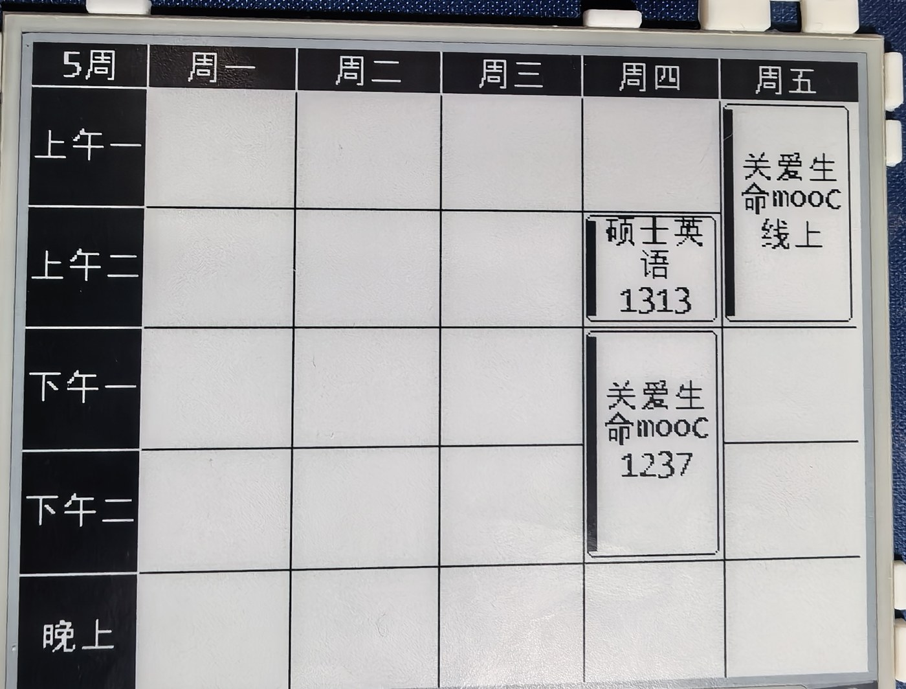
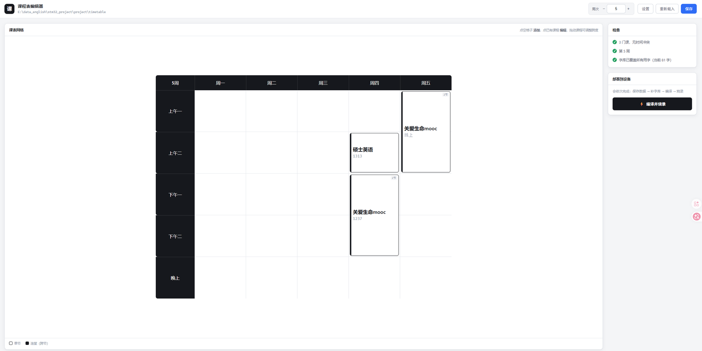

# STM32 墨水屏课程表

基于 **STM32F103C8T6** + **4.2 英寸黑白墨水屏（SSD1619A）** 的电子课程表。

墨水屏断电保持画面，所以刷一次就一直显示，静态使用几乎不耗电 —— 挂在桌上当课表很合适。



---

## 特性

**显示**
- **中文课程表**：5 天 × 5 大节网格，表头（星期）与首列（节次）反白强调
- **课程气泡**：课程显示为圆角气泡，跨节课程自动连成一块
- **左上角周次**：显示当前第几周

**驱动**
- **SSD1619A 驱动从零实现**
  - 初始化 / 显存绘图（点、线、矩形、圆角框）/ 刷新 / 深度睡眠
  - 命令集依据数据手册逐条核对（**注意：是 SSD1680 系列命令集**）
- **显存 1bpp**，400×300 = 15000 字节，直接位操作
- **中文字库为子集**：只打包你的课表用到的字，几十个字仅约 2KB

**分层清晰，好改**
- 字库 / 排版 / 驱动 / 业务四层单向依赖，改布局不动驱动，改驱动不动业务
- 课表数据独立成一个文件（`my_courses.c`），换课表只动它

**配套工具**
- **网页课表编辑器**：可视化 5×5 网格，点格子添加/编辑，实时冲突检测，一键生成代码 + 补字库
- **字库生成脚本**：从任意 TTF 生成点阵，自动跳过字库里已有的字

**调试**
- 硬件自检（4 张测试画面）+ 串口逐步诊断，方便定位接线问题

---

## 硬件

| 部件   | 型号 / 规格                                       |
| ------ | ------------------------------------------------- |
| MCU    | STM32F103C8T6（Cortex-M3，64KB Flash / 20KB RAM） |
| 屏     | 4.2" 黑白墨水屏，400×300，SSD1619A，24pin FPC     |
| 驱动板 | 24pin 通用转接板（纯转接，无电平转换）            |
| 调试器 | CMSIS-DAP / DAPLink（SWD 4 线）                   |

接线表、CubeMX 配置、转接板跳线说明 → 见 [HARDWARE.md](HARDWARE.md)

> 其他 4.2" 400×300 的黑白屏，只要控制器是 SSD1619A / SSD1680 系列，
> 改一下 `Core/Inc/epd.h` 的引脚宏即可复用这套驱动。

---

## 快速开始

### 第 0 步：补上 HAL 库

本仓库**不包含** `Drivers/`（ST 的 HAL 库与 CMSIS），以保持仓库轻量。
**首次编译前必须先补上**：

1. 用 **STM32CubeMX** 打开根目录的 `timetable.ioc`
2. 确认 `Project Manager → Toolchain/IDE` 选的是 **CMake**
3. 点 **GENERATE CODE**

CubeMX 会生成 `Drivers/` 目录，并补齐 `CMakeLists.txt` / `main.c` 的框架部分
（应用代码都在 `USER CODE` 块内，不受影响）。

### 第 1 步：编译

需要 `arm-none-eabi-gcc`、`cmake`（≥3.22）、`ninja`。

```bash
cmake --preset Debug
cmake --build build/Debug
```

产物：`build/Debug/timetable.elf`

> 若报找不到编译器，说明 `arm-none-eabi-gcc` 不在 PATH 里。
> 把这个工具链的 `bin` 目录加进 PATH 即可（`cmake/gcc-arm-none-eabi.cmake`
> 用的是标准前缀 `arm-none-eabi-`，不需要改成绝对路径）。

### 第 2 步：烧录

```bash
openocd -f interface/cmsis-dap.cfg -f target/stm32f1x.cfg \
  -c "program build/Debug/timetable.elf verify reset exit"
```

期望输出 `** Verified OK **`。也可用 ST-Link / J-Link 等任意 SWD 工具，
或先转成 bin/hex 再烧：

```bash
arm-none-eabi-objcopy -O binary build/Debug/timetable.elf build/Debug/timetable.bin
arm-none-eabi-objcopy -O ihex   build/Debug/timetable.elf build/Debug/timetable.hex
```

---

## 改课表

有两种方式，选一个就行。

### 方式 A：网页编辑器（推荐，不用记参数）

```bash
python tools/server.py       # 需要 Python 3
```

浏览器会自动打开 <http://127.0.0.1:8000>（Windows 上也可双击 `tools/课表编辑器.bat`）。



- 点**空格子**添加课程，点**已有课程**编辑
- 弹窗里选星期 / 起始节 / 持续节数，填课程名和教室
- 时间冲突会**当场标红并禁止保存**
- 点「生成代码」会：保存数据 → 检查并补齐字库 → 生成 `my_courses.c`

> 网页只做编辑和代码生成，**开箱即用**（只要 Python 3）。
> 想让它同时能编译/烧录，在网页「设置」里填上你的编译、烧录命令即可 ——
> 不填也能用，只是生成完需要你自己在终端编译。

### 方式 B：直接改代码

编辑 `Core/Src/my_courses.c`：

```c
TT_SetWeek(3);                                  // 左上角显示「3周」
TT_AddCourse(0, 0, 2, "高等数学", "主楼302");    // 周一 上午一~二 连堂
TT_AddCourse(1, 3, 1, "体育",     "操场");       // 周二 下午二 单节
```

| 参数 | 含义 |
| --- | --- |
| 星期 | `0~4` = 周一 ~ 周五 |
| 起始节 | `0~4` = 上午一 / 上午二 / 下午一 / 下午二 / 晚上 |
| 持续节数 | `1` 单节；`2` 连堂（气泡连成一块） |
| 教室 | 写全名即可，屏上**只显示房间号**（`主楼302` → `302`）；没数字的原样显示 |

**注意**：同一时段不能有两门课，冲突的会被拒绝（返回 0）。

调整布局（列宽、行高、节次名称）改 `Core/Inc/timetable.h` 顶部的宏。

---

## 中文字库

字库是**子集**：只包含 `tools/chars.txt` 里列出的字。好处是体积小
（几十个字约 2KB），代价是**加了新课就要同步**。

### 不同步会怎样

屏上那些没进字库的字会显示成**空心方框** —— 一眼能看出来。

### 怎么补

网页编辑器会自动处理。

手动的话：

```bash
# 1. 把新字加进 tools/chars.txt（直接写汉字，重复无妨，支持 # 注释）
# 2. 重新生成
python tools/font_export.py <你的中文字体> tools/chars.txt \
       Core/Src/font_cn.c FontCN --size 16
# 3. 重新编译
cmake --build build/Debug
```

脚本依赖：`pip install freetype-py`

**选字体的建议**：**等线（Deng.ttf）** 在 16px 小字下最清楚 ——
笔画细而均匀，不容易糊成一团。微软雅黑、黑体也可以，但黑体在小字号下
笔画容易粘连。

> ★ 脚本里有个 `BIN_THRESHOLD`（默认 100）控制二值化阈值，**这是清晰度的
> 关键旋钮**：细字体在 16px 下很多笔画像素灰度低于 128，用 128 会**整条笔画
> 丢掉**（屏上看着像「缺笔」）。取 100 能救回大部分。嫌粗就调高，嫌断就调低。

### 想换更大的字

16px 是 400×300 在 5×5 网格下能用的最大字号（再大，气泡一行放不下 3 个字）。
若换更大分辨率的屏，`--size` 可改成 8 的倍数（如 24、32），`font_cn.h` 里的
`FONT_CN_W/H` 要同步改。

---

## 代码结构

```
Core/
├── Src/
│   ├── my_courses.c    ★ 课表数据（改课表改这里）
│   ├── timetable.c       课表绘制：网格 / 气泡 / 周次
│   ├── textlayout.c      UTF-8 文本测量与折行（纯计算，不碰显存）
│   ├── epd.c             墨水屏驱动
│   ├── font.c            ASCII 8×16 字库
│   ├── font_cn.c         中文字库（自动生成，勿手改）
│   ├── log.c             串口打点
│   └── spi.c / gpio.c / usart.c / ...   外设配置（CubeMX 生成）
└── Inc/                  对应头文件

debug/                    诊断工具（默认不编译，见下）
├── epd_test.c            EPD_Diag()：逐步报告引脚/BUSY，定位屏不亮

tools/                    PC 端工具（与固件无关）
├── server.py             网页编辑器的本地服务
├── web/                  网页界面（纯 HTML/CSS/JS）
├── font_export.py        从 TTF 生成中文字库
└── chars.txt             字库用字清单

Drivers/                  ST HAL 库 + CMSIS（不随仓库分发，用 CubeMX 生成）
timetable.ioc             CubeMX 工程文件
cmake/                    CMake 构建脚本
```

**分层设计**（依赖严格单向向下）：

```text
my_courses.c   课表数据        （只填数据，不管怎么画）
   ↓
timetable.c    课表业务        （网格、气泡；只用 epd 的画图接口）
   ↓
textlayout.c   文本排版        （测量、折行；通过回调落笔，不认识 epd）
epd.c          屏驱动          （SPI 收发、显存操作；不认识课表）
   ↓
font*.c        字模数据        （不依赖任何东西）
```

好处：改布局不动驱动，改驱动不动业务，换课表只改一个文件。

---

## 运行流程

`main.c` 里就三步：

```c
EPD_Init();          // ① 初始化屏
MyCourses_Load();    // ② 填课表数据
TT_Show();           // ③ 绘制 + 刷新 + 睡眠
```

墨水屏断电保持画面，所以**刷一次就够**，主循环里不需要反复刷。
要接实时更新（切周次、日期变化），在循环里检测到变化再调 `TT_Show()`。

---

## 调试

屏不亮 / 刷新超时，用 `debug/` 里的诊断工具：

```bash
cmake --preset Debug -DENABLE_DEBUG_TOOLS=ON
cmake --build build/Debug
```

然后在 `main.c` 里调用 `EPD_Diag()`，它会逐步执行复位/初始化/写显存/刷新，
把每一步的引脚电平、BUSY 耗时、SPI 状态打到串口（USART1，115200 8N1）。

常见现象对照：

| 现象 | 可能原因 |
| --- | --- |
| BUSY 一直高、超时 | 转接板供电、BS1 跳线模式不对 |
| 全白刷不出来 | SPI 接线（SCK/MOSI 接反）、CS 没接对 |
| 白黑颠倒 | 显存极性（`EPD_Display` 里数据取反） |
| 四角/边框偏位 | 分辨率或 RAM 窗口设置 |
| 文字乱飘 | 检查 `textlayout` 的折行宽度是否传到（曾踩过未初始化数组的坑） |

占用情况：Flash 约 20KB / 64KB，RAM 约 18KB / 20KB（显存 15KB 占大头）。

---

## 许可

MIT
